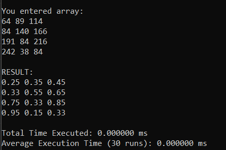
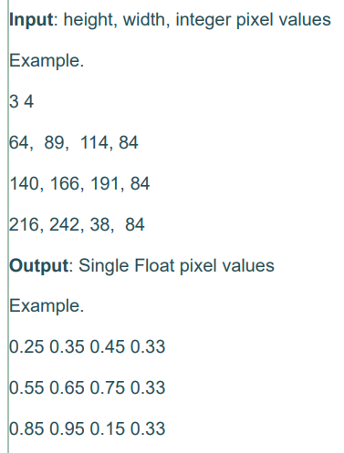
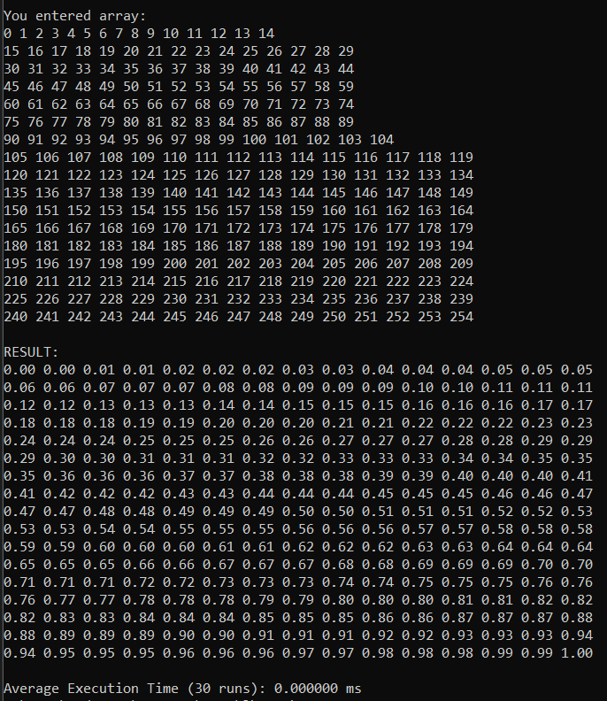

MP2 for LBYARCH Term 1 AY 2024-2025 
Alabat, Jeanne Hazel
Baterina, Patricia Ysabelle
Section S16

# About the Program

A grayscale image is interally represented as a 2d array, where the width represents the number of pixels in a row and the heigh represents the number of pixels in a column. The program converts an 8-bit signed (uint8) integer representation of the pixels (0 - 255) to a single precision floating-point rerpesentation using C and x86 assembly.

To convert the pixels, the following ration and proportion equation:

``f / i = 1 / 255.0``

where f is the float based pixel value and i is the integer based pixel value

The C program collects the input of the user for the image dimensions and the pixel values, and prints the coverted results, while the conversion function, imgCvtGrayIntToFloat is implemented in x86 assembly.

To compile and run the program, use the following commands below:

`nasm -f win64 imgGrayAsmFinal.asm`

`gcc -c imgGrayCFinal.c -o imgGrayCFinal.obj`

`gcc imgGrayCFinal.obj imgGrayAsmFinal.obj -o <program.exe>`

# Program Output (Correctness Check)

Images bellow show the program running with example array from the specs (Image 1 and 2) and and array of 0-255 to show correctness of the different pixel values (Image 3).

  

# Execution Time and Analysis

The execution time of the program was measured by running imgCvtGrayInttoFloat() function 30 times through various input dimensions. The average execution time was computed based on 30 runs and are shown in the table below:

Results from Running on Windows 10 Laptop, with Intel Core i5-10210U CPU, with 12 Gigabytes of DDR4 RAM
| Image Size   | Total Elements  | Execution Time (ms)|
|:------------:|:---------------:|:------------------:|
| 10 x 10     | 100             | 0.000000            |
| 100 X 100   | 10,000          | 0.033333            |
| 1000 X 1000 | 1,000,000       | 4.100000            |

Results from Running on Windows 11 Laptop, with 12th Gen Intel(R) Core(TM) i7-12650H CPU, with 32.0 GB RAM
| Image Size   | Total Elements  | Execution Time (ms)|
|:------------:|:---------------:|:------------------:|
| 10 x 10     | 100             | 0.000000            |
| 100 X 100   | 10,000          | 0.066667            |
| 1000 X 1000 | 1,000,000       | 6.600000            |

The program was able to get the correct values following the formula provided. The average time between the 30 runs depends on the different array sizes, and shows that the program takes more time (ms) the larger the array provided is. This is because of how the program goes through the individual elements of the array.
The program was proven to be efficient as the average execution times are less than a quarter of a second (which is 250 ms). Results may vary from different devices and what other programs they are running at time of execution.

